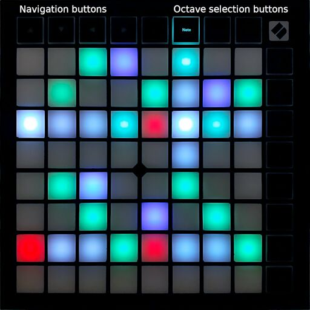
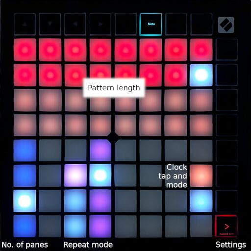
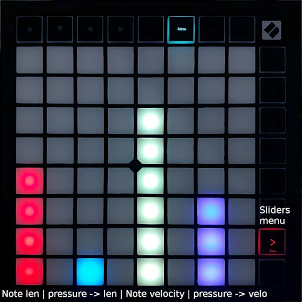

Arpfisch
========

**Arpfisch** is a MIDI arpeggiator / step sequencer written in [Rust](https://rustlang.org)
It is designed for use with a 8x8 grid button controller; currently, the *Novation LaunchpadX* is supported.

Playback does not restart upon pressing a new chord, making it ideal for rhythmic arpeggios that lay
base for a mix.

Features
--------

Its features include:

  - Intuitive matrix display for viewing and altering the pattern **live**.
  - Up to 32 steps. Multiple notes and octavated notes are possible.
  - Playing the chords **"top to bottom"** is possible by using *negative*
    note numbers.
  - View can be **split** to display more steps at once.
  - Three different note repetition modes.
  - **Live modulation** of the note length and the velocity, either using the
    grid buttons or via MIDI *(not yet).*
  - **Chord hold** mode.
  - Synchronization to an external **MIDI clock**.
  - Internal MIDI **clock generation**.
  - Tap to input a tempo.
  - Easy to extend: Clean abstractions facilitate adding new grid-based midi
    controllers as input devices.

User's guide
------------

Currently, only the [Jack audio system](https://jackaudio.org) is supported. MIDI must be bridged
to JACK using a2jmidid.

After startup, *arpfisch* will automatically connect to a Launchpad X, if present. You need
to manually connect your MIDI keyboard to the input port, and your MIDI synthesizer to the
output port of the program. Connect any MIDI clock, if desired, to the in port as well.

The launchpad will display a default pattern in green and a running playhead in white. The
view can be navigated using the arrow buttons.

### Main view

A horizontal white line indicates the "zero" line, i.e. the lowest note of the input chord.
Buttons above this line will select the higher notes of the chord (subject to *Note repetition*,
see below), buttons below this line will select the highest, second-highest etc notes of the chord.
(Note that you need to press the "down" navigation button a couple of times first.)

Steps are set and cleared by quickly tapping the corresponding buttons. The tap velocity will
be used as note velocity; currently, the velocities of the input chords are ignored.

The step color indicates the octave. White is used when multiple octaves are set on a single step.
The octave for new steps can be changed by pressing the four buttons right of the navigation arrow
buttons, the octave for existing steps can be altered by holding down any existing step and then
pressing the octave buttons. (Don't un-set all octaves accidentially, though...)

Notes longer than a single step can be entered by holding down the start step, then tapping
the desired end step. The note duration is indicated by dimly lit step buttons.

*Chord hole mode* can be enabled by pressing the top button in the right column. When enabled,
chords need to be only tapped shortly and they will play until a new chord is pressed, keeping
your hands free for other work. (Purple means off, blue means on.)

### Note repetition

If a triad chord is given as input, but the fourth note is set to be played,
three diffent *repetition modes* can be selected to produce different results:

  - Clamp (*yellow*): the fourth, fifth etc note is just clamped to the top note of the
    input chord.
  - Mirror (*cyan*): the input chord is infinitely mirrored back and forth, e.g. C, E, G, B
    would become C, E, G, B, G, E, C, E, G, B, ...
  - Repeat (*pink*): the input chord is infinitely repeated, with a selectable octave shift
    for each repetition.

The note repetition can be changed using the three-button-selector on the lower left half
of the *settings menu* (see below). If *repeat (pink)* is selected, another selector opens
for octave shift selection.

### Settings menu

The settings menu can be opened using the bottom button on the right button column.

Its upper half allows you to set the number of steps in the pattern.

The lower half contains various settings, from left to right:

  - *View split count (blue)*: Splits the view in one 8x8 field, two 8x4 fields or four 8x2 fields.
  - *Note repetition (white)*: See above.
  - Clock / tempo indicator and settings:
    - The upper button flashes if a MIDI clock is present. Orange indicates the use of the internal
      clock, green means "external". Solid dark green means "No external clock is present", the
      playhead will be stopped.
    - Tapping the upper button when flashing orange sets the new tempo of the internal clock.
    - The lower button controls the *clock selection*: orange means "always use the internal clock",
      green means "always use the external clock", white auto-selects the clock source (external if
      present, internal if not).

### Slider menu

The slider menu can be opened using the second button from the bottom on
the right button column.

It allows to control the following settings either as slider or via pressure on the slider
(the launchpad must be configured for polyphonic aftertouch):

  - Global note length modifier (0x - 2x)
  - Influence of the step intensity (i.e. the velocity the step was entered with) on the note length
  - Global velocity modifier
  - Influence of the step intensity on the note velocity

License
-------

This program is released under the terms of the [GNU General Public License 3](LICENSE) (exactly
version 3, no later version).
